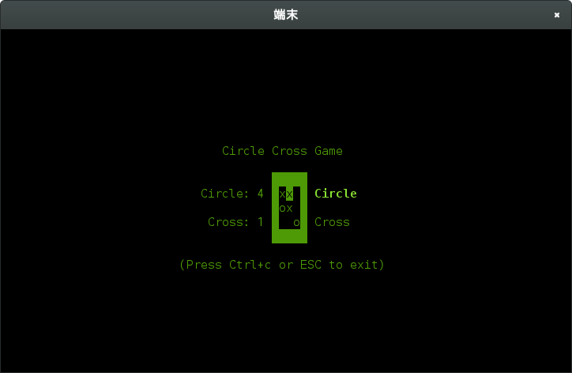

CircleCrossGame
====================

This is a CLI game application.
a.k.a marubatu game.



Installation
-----

`circlecrossgame` can be easily installed as an executable.
Download the latest
[compiled binaries](https://github.com/kusabashira/circlecrossgame/releases)
and put it anywhere in your executable path.

Or, if you've done Go development before
and your $GOPATH/bin directory is already in your PATH:
```
$ go get github.com/kusabashira/circlecrossgame
```

Usage
====================

```
$ circlecrossgame
```

It will start game.
(press the ESC key to exit)

Operation
====================

###Menu
| Key    |                       |
|--------|-----------------------|
| Right  | Toggle first putter   |
| Left   | Toggle first putter   |
| Space  | Start this game       |
| Enter  | Start this game       |
| ESC    | Quit this application |
| Ctrl+C | Quit this application |

###Game
| Key    |                            |
|--------|----------------------------|
| Up     | Move to the top            |
| Down   | Move to the bottom         |
| Right  | Move to the right          |
| Left   | Move to the left           |
| Space  | Put Cell on current cursor |
| Enter  | Put Cell on current cursor |
| ESC    | Quit this application      |
| Ctrl+C | Quit this application      |

###Result
| Key    |                       |
|--------|-----------------------|
| Right  | Toggle replay         |
| Left   | Toggle replay         |
| Space  | Decide replay         |
| Enter  | Decide replay         |
| ESC    | Quit this application |
| Ctrl+C | Quit this application |

License
====================

MIT License

Author
====================

kusabashira <kusabashira227@gmail.com>
